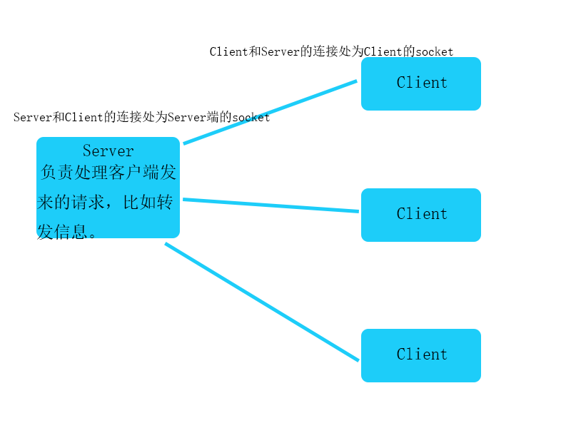

# ChatRoom

课程设计：一个简易的聊天室，基于TCP协议传输数据，并采用序列化的方式传输对象。旨在学习socket和多线程。

## 功能

1. 登录，注销。
2. 单聊。
3. 群发消息。

## 结构图

## 实现所涉及的技术点

- Java Swing （编写UI）.
- 多线程。
- TCP协议。
- 序列化和反序列化

## 遇到的问题

1. 在socket的生命周期中，只能有一个序列化流和一个反序列化流，即一个`ObjecOutputStream`和一个`ObjectInputStream`，否则会出现`java.io.StreamCorruptedException: Invalid type code: AC`异常错误。

   - 解决措施

     把每一个socket对应的ObjectInputStream和ObjectOutputStream对象作为全局变量存储到哈希表中。

     [参考文献](http://inaved-momin.blogspot.com/2012/08/understanding-javaiostreamcorruptedexce.html)

2. Message作为的传输的对象，实现序列化接口。一个Message对象，重复写入到序列化流中，并且每次都修改对象的某个属性。在接收端反序列化后，得到的结果都为对象的第一次的数据，第一次的状态。

   - 解决措施

     每此写入都重新定义一个新的对象。

   - 产生原因

     原因不明，个人猜测为序列化只记录对象的一个状态，所以如果对象属性修改的话，并不能保存。